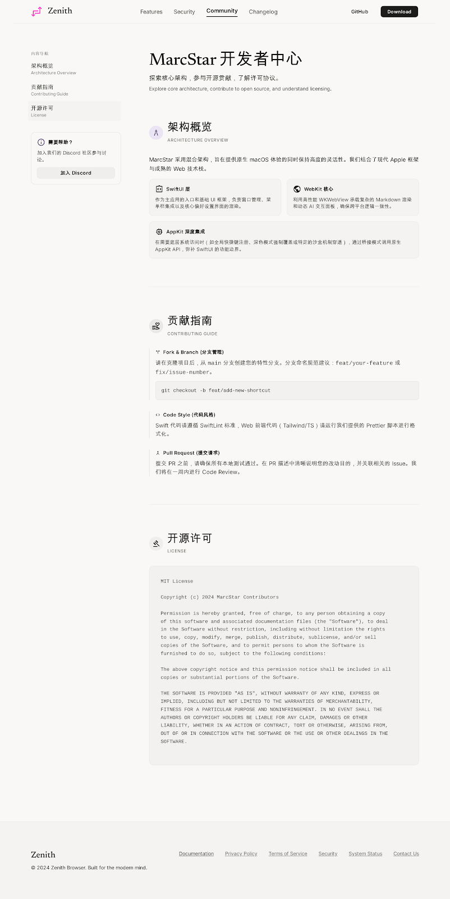

# MarcStar

**One page. Zero browser clutter.**

A focused macOS browser built with SwiftUI and WebKit—designed to turn any website into a clean, app-like workspace.

## Why it exists

Browsers are built for twenty tabs.

MarcStar is built for one thing at a time.

Open a site, remove the chrome, keep the shortcuts, and let it behave like a native macOS app.

## What it does

- Native <code>WKWebView</code> rendering
- Minimal, borderless interface
- URL input and local history
- Full-page PNG export
- Fast keyboard actions
- Open the current page in your default browser
- SwiftUI + AppKit, structured with MVVM

## Shortcuts

| Action | Shortcut |
|---|---|
| URL input | <kbd>⌘ U</kbd> |
| History | <kbd>⌘ X</kbd> |
| Refresh | <kbd>⌘ R</kbd> |
| Export PNG | <kbd>⌘ E</kbd> |
| Open in browser | <kbd>⌘ O</kbd> |
| Shortcut guide | <kbd>⌘ C</kbd> |

## Run it

Requirements: macOS 13+ and Xcode.

~~~bash
git clone https://github.com/mangiapanejohn-dev/marcstar.git
cd marcstar
open "Swift-:/MarcBrowser.xcodeproj"
~~~

Select the <code>MarcBrowser</code> scheme and press Run.

## Repository map

| Path | What is inside |
|---|---|
| <code>Swift-:/MarcBrowser</code> | Native macOS app |
| <code>Swift-:/README.md</code> | Full English documentation |
| <code>Swift-:/README_ZH.md</code> | 中文文档 |
| <code>marcStar-website</code> | Product website and visual assets |

## Stack

<code>Swift</code> · <code>SwiftUI</code> · <code>WebKit</code> · <code>AppKit</code> · <code>MVVM</code>

## License

MIT — see <a href="Swift-:/LICENSE">LICENSE</a>.

Built by <a href="https://marcyy.me">Marc</a>.  
Less browser. More web.

